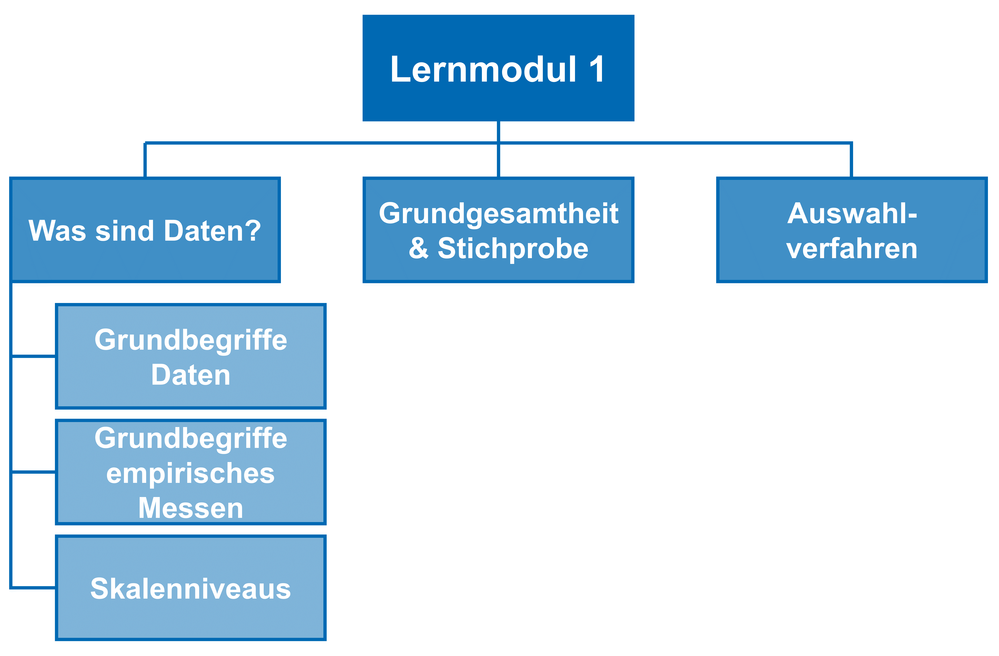

# Lernmodul 1: Grundlagen wiederholen

In diesem Lernmodul geht es um die Grundbegriffe der empirischen Sozialforschung. Daneben wird nochmals kurz wiederholt, was Grundgesamtheit und Stichprobe ist und welche Auswahlverfahren wir anwenden können.

Über diesen Button {} {} kannst du Fehler auf Seiten direkt an uns melden. Dazu musst du dich einmalig mit der JLU-Kennung anmelden. Du findest den Button auf jeder Seite.

{} {} 

{} {}

{} {}