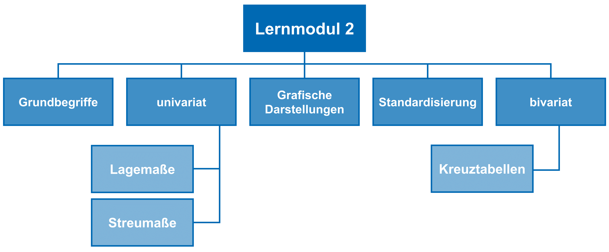

# Lernmodul 2: Deskriptive Statistik 

In diesem Kapitel des Lernmoduls wird in die [deskriptive Statistik](../../glossar/deskriptivestatistik/index.html) eingeführt. Zuerst werden die Grundbegriffe erläutert. Anschließend werden **Lage- und Streumaße** zur Deskription von [Variablen](../../glossar/variable/index.html) dargestellt und die **grafische Darstellungen** von Variablen vorgestellt. Danach wird in die **Standardisierung von Variablen** eingeführt, bevor das Lernmodul mit der **bivariaten Darstellung von Variablen** in Kreuztabellen abschließt.

## Inhalt des Lernmoduls: 

