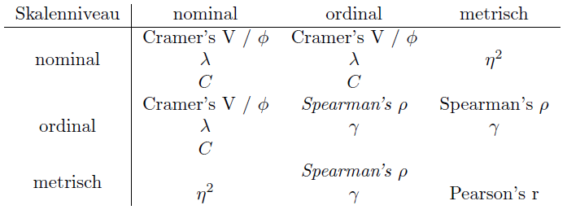

### Kapitel  1

# Grundlagen

In diesem Kapitel werden die Grundlagen für die Berechnung der Zusammenhangsmaße vorgestellt: Zuerst wird dazu die Berechnung von Chi-Quadrat vorgestellt. Anschließend wird die Logik von PRE-Maßen vorgestellt und abschließend die Korrelation dargestellt. 

In den nachfolgenden Kapiteln wird dann die Berechnung der einzelnen Maße vorgestellt. Anhand der folgenden Abbildung können Sie die verschiedenen Zusammenhangsmaße einordnen.

{} {} 

{{% buttonShare href="mailto:?subject=Schau%20dir%20das%20mal%20an%3A%20" icon="fas fa-paper-plane" %}} {}

{} {}

{} {}

{} {}

{} {}

{} {}
