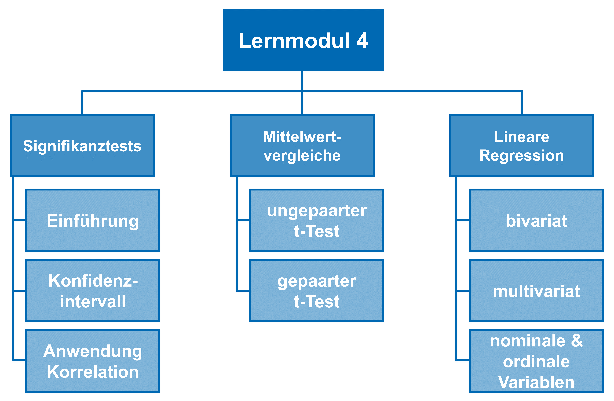

# Lernmodul 4: Signifikanztests, Mittelwertvergleiche & lineare Regression

In diesem Lernmodul werden Ihnen weitere **quantitative Analysetechniken** dargestellt. Das Web-Based-Training führt an dieser Stelle in die [Hypothesentests bzw. Signifikanztests](./chapter1/index.html) ein. Hier werden zum einen Konfidenzintervalle berechnet und die Signifikanz der [Korrelation aus dem vorherigen Lernmodul](../LM3/chapter2/subchapter3/page-2-3-a/). Anschließend werden [Mittelwertvergleiche](./chapter2/index.html) vorgestellt, bevor abschließend in die [lineare Regression](./chapter3/index.html) eingeführt wird.

Hier sehen Sie den Aufbau des Lernmoduls:

