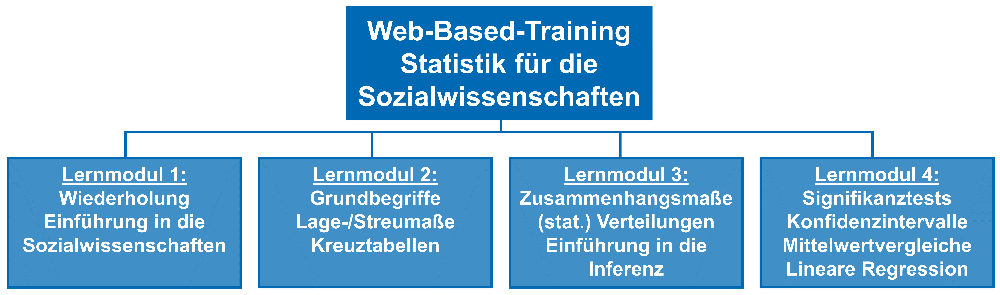

# Einführung in das Web-Based-Training

Das Web-Based-Training ist als begleitendes Lernmaterial für die Vorlesungen *Statistik für die Sozialwissenschaften I* und *Statistik für die Sozialwissenschaften II* im Bachelorstudiengang *Social Sciences*. Die Lernmodule sind wie folgt thematisch geteilt:

Hier geht es zu den einzelnen Lernmodulen: 

[Lernmodul 1](./lm1/index.html)

[Lernmodul 2](./lm2/index.html)

[Lernmodul 3](./lm3/index.html)

[Lernmodul 4](./lm4/index.html)

Über diesen Button {} {} kannst du Fehler auf Seiten direkt an uns melden. Dazu musst du dich einmalig mit der JLU-Kennung anmelden. Du findest den Button auf jeder Seite.

{} {} 

{{% buttonShare href="mailto:?subject=Schau%20dir%20das%20mal%20an%3A%20" icon="fas fa-paper-plane" %}} {}

{} {}

{} {}

{} {}

{} {}

{} {}
